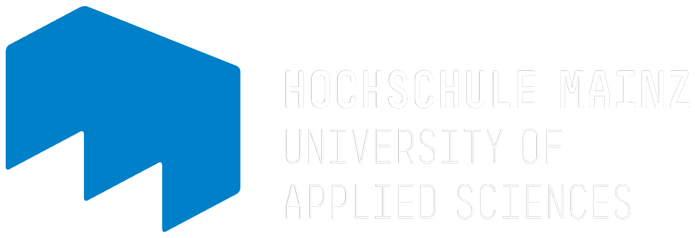

* TOC
{:toc}

# Thesis
<object data="../assets/Ternes_Masterarbeit.pdf" width="1000" height="1000" type='application/pdf'></object>

# Poster
<object data="../assets/Ternes_Poster.pdf" width="750" height="500" type='application/pdf'></object>

# Code
Click to download: 
- <a href="../assets\rcode\GRutils.R">Utility functions for data conversion/import</a>  
- <a href="../assets\rcode\import_Data.R">Data import script</a> 
- <a href="../assets\rcode\GenreScraping.R">Web scraping script</a> 
- <a href="../assets\rcode\teststats.R">Data preparation and preliminary analysis script</a> 
- <a href="../assets\rcode\data_cleaning.R">Data cleaning script</a> 
- <a href="../assets\rcode\Network_skript.R">Network construction script</a> 
- <a href="../assets\rcode\communities.R">Cluster Analysis script</a> 

# Affiliations

  <ul float="right" style="list-style: none; background: #22272e">
    <li>
      
      
    </li>
    <li>
      
      
    </li>
  </ul>

